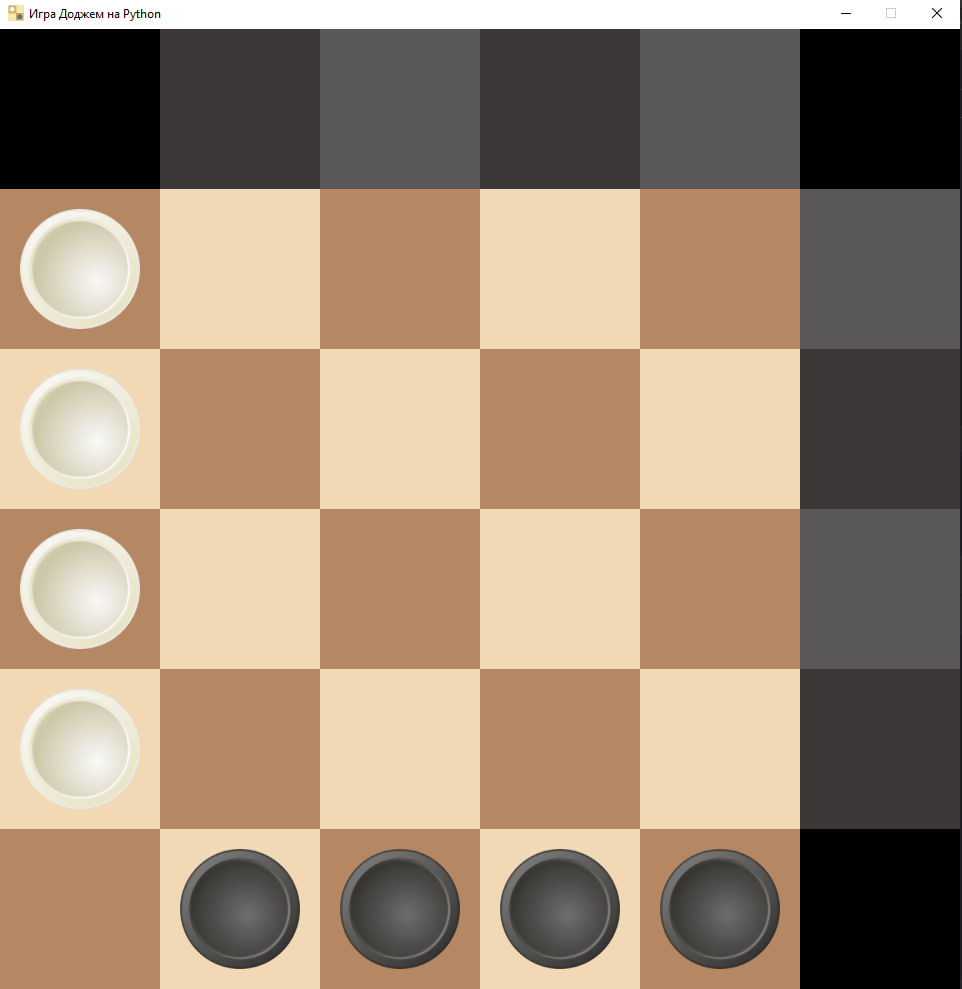

# Игра Доджем на Python

[](https://www.python.org)
[](https://www.pygame.org)

Классическая стратегическая игра Доджем теперь на вашем компьютере! 🎮  
Два игрока, простая механика и глубокая стратегия - всё, что нужно для увлекательной партии. ♟️



## О игре

Доджем - это стратегическая игра на доске 6×6 для двух игроков. Цель:
- **Белые фишки** должны достичь правого края доски
- **Чёрные фишки** должны достичь верхнего края доски

Особенности реализации:
- Анимированные перемещения фишек
- Подсветка допустимых ходов
- Определение победителя автоматически
- Возможность сохранения игры

## Как запустить

1. Установите [Python 3.12](https://www.python.org/downloads/) или новее
2. В терминале ввести команду:
   ```bash
   git clone https://github.com/d1ssmuss/Dodge
   ```
3. Установите зависимости:
   ```bash
   pip install -r requirements.txt
   ```
4. Запустите игру:
   ```bash
   python dodgem.py
   ```

## Правила игры

### Основные правила
- Игроки ходят по очереди
- Белые ходят первыми
- Фишки двигаются только вперёд:
  - Белые: вверх, вправо или вниз
  - Чёрные: влево, вправо или вверх
- Фишка, достигшая своего края, блокируется

### Условия победы
1. **Для белых** - 4 фишки в правом столбце
2. **Для чёрных** - 4 фишки в верхней строке
3. Если у игрока нет допустимых ходов - он проигрывает

### Управление
- **ЛКМ** - выбрать фишку и сделать ход
- **ESC** - вернуться в меню
- **Ctrl+S** - сохранить игру

## Источники
- [Официальные правила игры](https://lotos-khv.ru/game/games/dodjem.pdf)
- [Пример игры на YouTube](https://www.youtube.com/watch?v=4G6tjJQGgpU)
- [Тактика игры](https://www.youtube.com/watch?v=XhgV7ylc-qc)

## Разработчик
Игра разработана на Python с использованием библиотеки Pygame.
Приятной игры! 🎲
